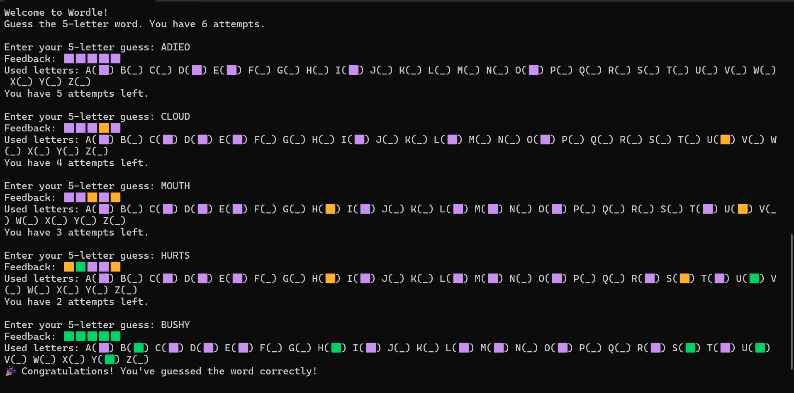

# Wordle Game

A simple Python-based command-line Wordle game where players have six attempts to guess a five-letter word with feedback on letter positions.

  

## Features
- Random five-letter word selection from a text file.
- Color-coded feedback to indicate correct and misplaced letters.
- Tracks guessed letters to assist in solving the puzzle.

